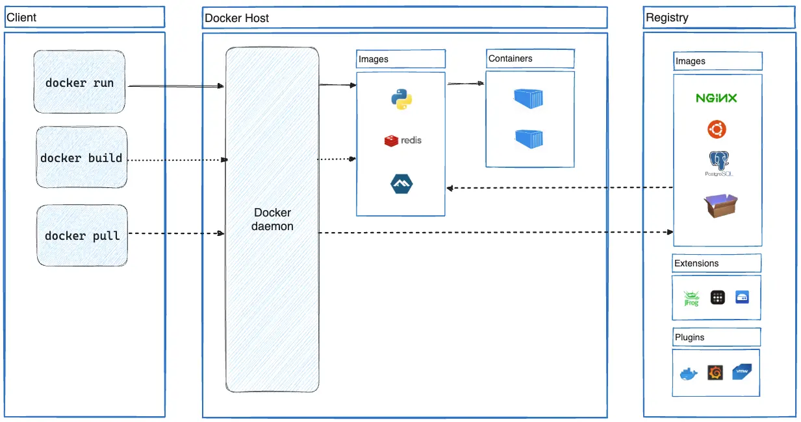

# Docker 기본 개념 및 클라우드 개념 비교 

## 클라우드 환경(AWS/GCP/Azure)에서 컨테이너 활용

### 1. AWS ([AWS - 공식문서](https://aws.amazon.com/ko/containers/))

| 서비스 | 한 줄 설명 | 핵심 역할 | 주 사용 대상 |
|------|-----------|-----------|-------------|
| **Amazon ECS** | AWS에서 컨테이너 애플리케이션을 쉽게 구축·관리·확장 | AWS 전용 컨테이너 오케스트레이션 | Kubernetes 없이 빠르게 컨테이너 운영하려는 팀 |
| **Amazon EKS** | Kubernetes 클러스터를 관리 부담 없이 운영 | 관리형 Kubernetes 서비스 | K8s 표준/이식성이 필요한 팀 |
| **Amazon ECR** | 컨테이너 이미지를 저장·공유·배포 | 컨테이너 이미지 레지스트리 | ECS / EKS / 외부 K8s |
| **AWS Fargate** | 서버 관리 없이 컨테이너 실행 | 서버리스 컨테이너 실행 환경 | 인프라 관리 최소화가 목표인 팀 |

### 2. GCP ([GCP - 공식문서](https://cloud.google.com/containers?hl=ko))

| 제품 및 솔루션 | 주요 특징 | 핵심 가치 / 용도 |
|----------------|-----------|------------------|
| **Google Kubernetes Engine (GKE)** | 안정성이 높은 완전 관리형 Kubernetes 서비스로, 모든 워크로드에 컨테이너 최적화 컴퓨팅을 제공하며 AI/ML을 위한 확장 가능한 기반과 개방형 표준 및 권장 아키텍처를 지원 | 관리 부담 없는 Kubernetes 운영 및 표준 기반 대규모 컨테이너 플랫폼 |
| **Cloud Run** | 컨테이너의 유연성과 서버리스의 단순성을 결합하여 소스 코드부터 시작해 다중 리전에서 웹 애플리케이션을 빠르게 빌드하고 배포 가능 | 서버 관리 없이 웹 기반 컨테이너 애플리케이션 실행 |
| **Cloud Build** | Java, Go, Node.js 등 다양한 언어로 컨테이너 기반 빌드·테스트·배포를 지원하며 대규모 병렬 빌드와 여러 실행 환경으로의 배포를 제공 | 완전 관리형 CI/CD 및 빌드 자동화 |
| **Artifact Registry** | Docker 이미지와 패키지를 단일 위치에서 안전하고 확장 가능하게 저장·관리하는 범용 아티팩트 저장소 | CI/CD 파이프라인의 중앙 패키지 관리 |
| **Cloud Code** | IDE에 통합되어 Kubernetes 애플리케이션 작성, 실행, 디버깅을 지원하며 Gemini Code Assist와 Skaffold로 개발 생산성 향상 | GKE 및 Cloud Run 중심의 개발 경험 개선 |
| **Deep Learning Containers** | 주요 데이터 과학 프레임워크와 도구가 포함된 성능 최적화 컨테이너 환경 제공 | ML/AI 워크플로의 빠른 실험과 배포 |
| **Migrate to Containers** | 기존 VM 기반 워크로드를 GKE 컨테이너로 단계적으로 이전하고 운영 자동화를 가속 | 레거시 시스템의 컨테이너 전환 및 현대화 |
| **클라우드 애플리케이션 현대화 프로그램 (CAMP)** | 애플리케이션 포트폴리오를 평가·계획·구현·측정하는 엔드 투 엔드 현대화 프레임워크 제공 | 조직 차원의 체계적인 클라우드 전환 |
| **플랫폼 엔지니어링** | 내부 개발자 플랫폼(IDP)을 통해 워크로드를 표준화하고 개발자 경험과 안정성을 향상 | 개발 생산성 향상 및 출시 속도 개선 |

### 3. AZURE ([AZURE - 공식문서](https://learn.microsoft.com/ko-kr/azure/architecture/guide/choose-azure-container-service))
   
| 원하는 기능 | 추천 Azure 제품 | 핵심 설명 |
|------------|----------------|-----------|
| 관리형 Kubernetes에서 컨테이너 배포 및 스케일링 | **AKS (Azure Kubernetes Service)** | 완전 관리형 Kubernetes로 컨테이너 애플리케이션을 배포·확장 |
| 관리형 Red Hat OpenShift에서 컨테이너 배포 및 스케일링 | **Azure Red Hat OpenShift** | Red Hat과 공동 운영하는 엔터프라이즈급 OpenShift |
| 서버리스 컨테이너로 최신 앱과 마이크로서비스 빌드 및 배포 | **Azure Container Apps** | K8s 기반 서버리스 컨테이너 플랫폼 |
| 엔드투엔드 개발 환경에서 이벤트 기반 서버리스 코드 실행 | **Azure Functions** | 이벤트 트리거 기반 서버리스 함수 실행 |
| Windows 및 Linux에서 컨테이너화된 웹앱 실행 | **Web App for Containers** | App Service 기반 컨테이너 웹 애플리케이션 실행 |
| 하이퍼바이저 격리로 컨테이너 시작 | **Azure Container Instances (ACI)** | VM 없이 컨테이너를 즉시 실행 |
| 항상 가용하고 스케일링 가능한 분산 앱 배포 및 운영 | **Azure Service Fabric** | 대규모 분산 시스템 및 마이크로서비스 플랫폼 |
| 컨테이너 이미지 및 아티팩트 빌드·저장·보호·복제 | **Azure Container Registry (ACR)** | Docker 이미지와 OCI 아티팩트 저장소 |

### 3사 비교 

| 영역 | AWS | GCP | Azure | 비고 / 선택 포인트 |
|-----|-----|-----|-------|-------------------|
| 관리형 Kubernetes | EKS | GKE | AKS | GKE는 자동화·안정성, EKS는 AWS 통합, AKS는 Azure AD 연계 강점 |
| 서버리스 컨테이너 | Fargate (ECS/EKS) | Cloud Run | Azure Container Apps | Cloud Run이 가장 단순, Container Apps는 KEDA 기반 |
| 컨테이너 오케스트레이션 (비 K8s) | ECS | — | Service Fabric | ECS는 AWS 전용, Service Fabric은 Azure 특화 |
| 컨테이너 이미지 레지스트리 | ECR | Artifact Registry | ACR | 3사 모두 OCI 표준 지원 |
| CI/CD (컨테이너 빌드) | CodeBuild / CodePipeline | Cloud Build | Azure DevOps / GitHub Actions | GCP는 Cloud Build 단순, Azure는 DevOps 통합 |
| 단일 컨테이너 즉시 실행 | — | — | Azure Container Instances | Azure만 제공 (VM 없는 즉시 실행) |
| 웹앱 + 컨테이너 | App Runner | Cloud Run | Web App for Containers | HTTP 서비스에 적합 |
| OpenShift | — | — | Azure Red Hat OpenShift | Azure만 완전 관리 OpenShift |
| 로컬/개발 도구 | ECS CLI / Copilot | Cloud Code | Azure Developer CLI | 개발자 경험 차별화 |
| ML/AI 컨테이너 | SageMaker Containers | Deep Learning Containers | Azure ML Containers | GCP는 GPU/AI 친화적 |

## VM과 Docker의 차이점
 
   - **VM**은 하드웨어를 가상화해 각 인스턴스가 **자체 커널과 OS**를 실행
   **Docker 컨테이너**는 하드웨어가 아닌 **호스트 커널을 공유**하며 사용자 공간만 격리
  -  VM은 **격리·보안이 강한 대신** 무겁고 기동이 느리다. Docker는 **가볍고 빠르며** 애플리케이션 단위 배포·확장에 유리

## Docker의 주요 개념

1. Docker Client: 사용자가 도커와 소통하는 창구. 
   터미널에서 docker run 같은 명령어를 입력하면 이를 Docker Daemon에 전달합니다.

2. Docker Daemon (dockerd): 호스트 OS에서 백그라운드로 실행되며, 클라이언트의 요청을 받아 도커 이미지 생성, 컨테이너 실행 및 관리 등 실제 무거운 작업들을 처리하는 엔진 역할을 합니다.

3. 이미지 (Image): 애플리케이션 실행에 필요한 모든 것을 담고 있는 읽기 전용 템플릿입니다.

4. 컨테이너 (Container): 이미지를 실행시킨 실체로, 독립된 프로세스 공간에서 구동됩니다.

5. 레지스트리 (Registry): 생성된 이미지를 저장하고 공유하는 공간입니다.

## 클라우드에서 Docker를 사용하는 이유

1. 인프라 비용 최적화 (Density)
이유: VM은 OS 마다 수 GB의 메모리를 점유하지만, Docker는 필요한 프로세스만큼만 자원을 사용합니다.

결과: 동일한 사양의 클라우드 인스턴스(EC2 등)에 더 많은 서비스 인스턴스를 띄울 수 있어 서버 비용이 절감됩니다.

2. 가용성과 빠른 오토스케일링 (Agility)
   이유: VM 부팅은 분 단위가 소요되지만, 컨테이너는 초 단위로 실행됩니다.

결과: 갑작스러운 트래픽 증가 시 클라우드의 Auto-scaling 기능과 결합하여 즉각적으로 대응할 수 있습니다.

3. 환경 전이 문제 해결 (Consistency)
   이유: 클라우드 제공업체를 바꾸거나(AWS → Azure), 로컬에서 클라우드로 이전할 때 환경 설정 오류가 빈번합니다.

결과: "내 컴퓨터에선 됐는데?"라는 말이 사라집니다. 도커 이미지 자체가 표준화된 규격이므로 벤더 종속성(Lock-in) 없이 자유롭게 이전이 가능합니다.

4. 현대적 배포 방식 (CI/CD & MSA)
   이유: 서비스를 작게 쪼개는 마이크로서비스(MSA) 구조에서는 관리할 대상이 수십, 수백 개로 늘어납니다.

결과: 도커 컨테이너는 배포 단위가 명확하여 쿠버네티스(Kubernetes) 같은 오케스트레이션 도구와 연동해 자동 배포 및 관리를 용이하게 합니다.