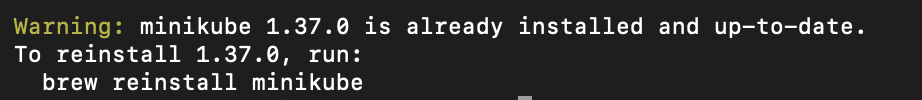

# 1.Minikube 설치 및 클러스터 구성 
## 1-1. Minikube를 설치하고 실행 (MacOS)
### 1-1-1.설치
```
brew install minikube
```


* 수업시간에 이미 깔아둬서 설치된 상태로 나옴

### 1-1-2. 버전확인

```
minikube version
```


### 1-1-3. kubectl 설치
```
brew install kubectl
```


## 1-2.Kubernetes 클러스터를 올리고 상태 확인
### 1-2-1. 쿠버네티스 클러스터 생성

```
minikube start --driver=docker
```


### 1-2-2. 상태확인

```
minikube status
```


## 1-3.Kubectl을 활용하여 클러스터가 정상적으로 동작하는지 점검
### 1-3-1. kubectl로 클러스터 점검

```
kubectl cluster-info
```


### 1-3-2. 노드상태 확인

```
kubectl get nodes
```


### 1-3-3. 기본 파드 확인

```
kubectl get pods -A
```


