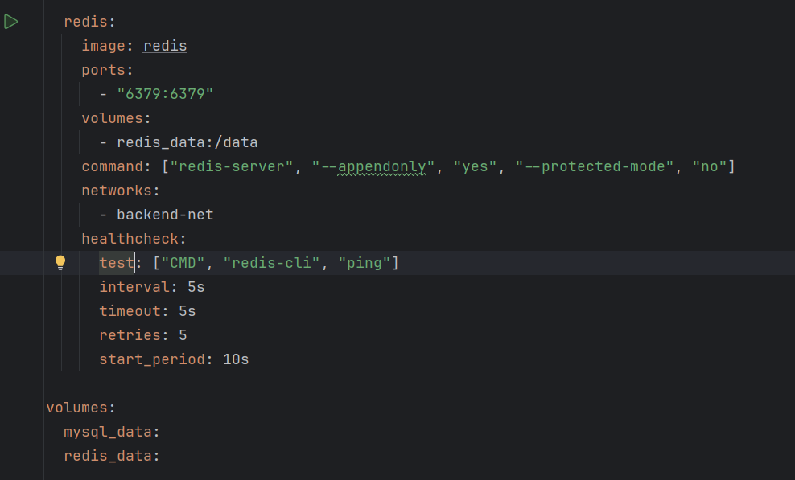
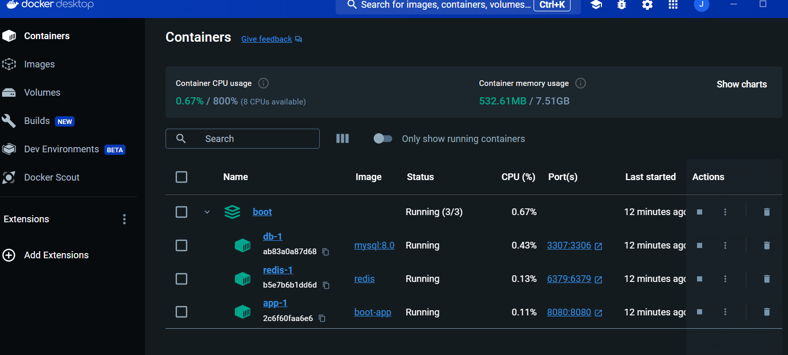
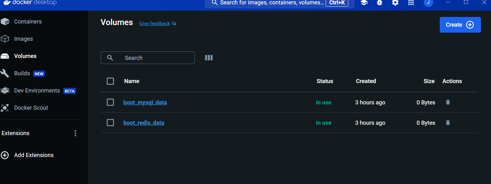
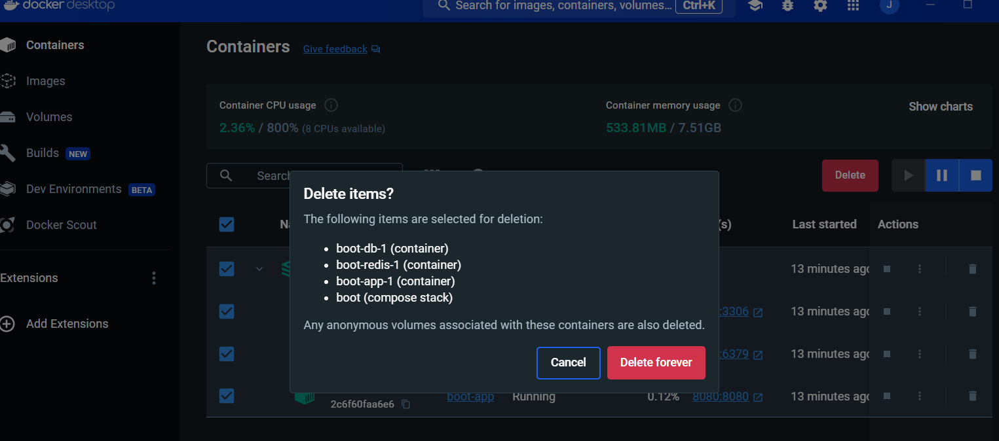
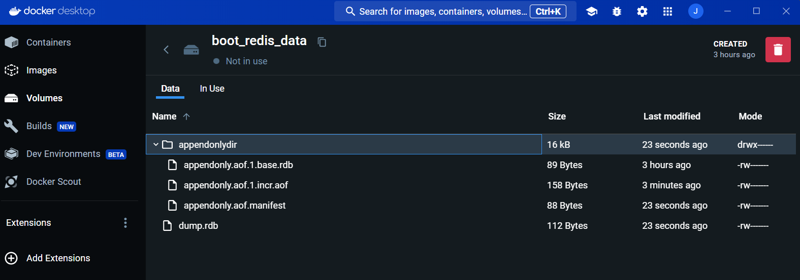
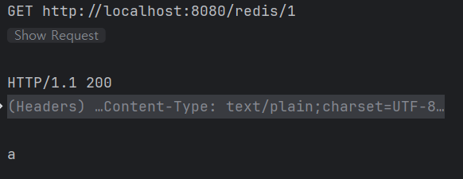

# Docker 볼륨을 활용한 데이터 유지

Docker 컨테이너는 기본적으로 상태 비저장(stateless)이지만, 볼륨(Volume)을 사용하면 데이터를 영구적으로 저장할 수 있습니다. 볼륨은 호스트 머신에 Docker가 관리하는 특정 영역에 데이터를 저장하며, 컨테이너가 삭제되어도 데이터는 그대로 보존됩니다.

## 1. Docker 볼륨 생성

docker-compose로 volume 지정.
만약 volume에 없다면 생성




생성된 볼륨 목록은 다음 명령어로 확인할 수 있습니다.
```bash
docker volume ls
```

## 2. 레디스 컨테이너 실행 시 볼륨 사용





## 3. 데이터가 유지되는지 확인





## 4. 새 컨테이너를 동일한 볼륨으로 실행하여 데이터 확인

기존 레디스에 데이터 저장 확인

key : 1
value : a



추가적으로 appendonly : yes 설정 필요 ..


