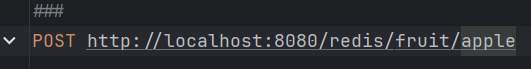
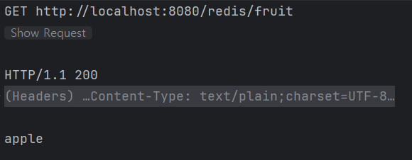

****# Docker 네트워크 실습

## 1. Docker 네트워크 생성

docker compose 에 network 설정
없다면 생성.

## 2. Redis 컨테이너를 mynetwork에 연결하여 실행

생성한 네트워크에 Redis 컨테이너를 연결하여 실행합니다. 


## 3. Spring Boot App을 mynetwork에 연결하여 실행

Spring Boot 애플리케이션을 Docker 이미지로 빌드한 후, 
`backend-net`에 연결하여 실행합니다.


## 4. Spring 앱과 Redis 연동 확인

**데이터 저장 (POST 요청):**
```bash
POST http://localhost:8080/redis/fruit/apple
```



**데이터 조회 (GET 요청):**
```bash
http://localhost:8080/redis/fruit
```
