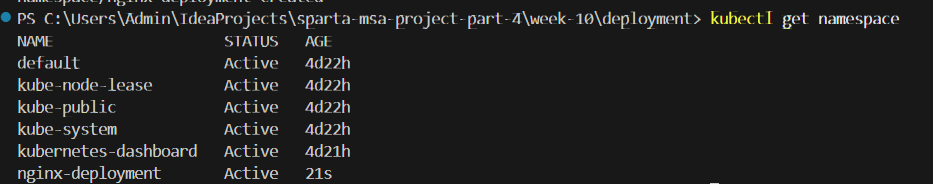
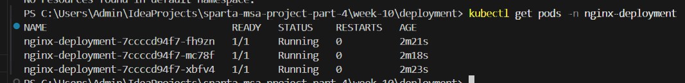
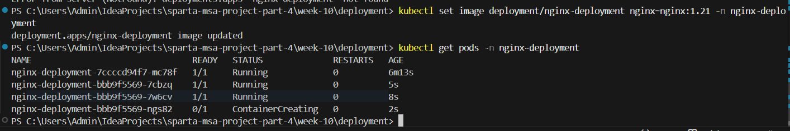
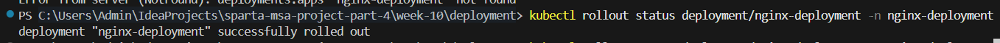

# 1. 네임스페이스 생성 .

```
kubectl create namespace nginx-deployment
```



# 2. deployment 생성 

```
kubectl apply -f nginx-deployment.yaml
kubectl get pods
```



# 3. 이미지 버젼 변경


```
kubectl set image deployment/nginx-deployment nginx=nginx:1.21
```



