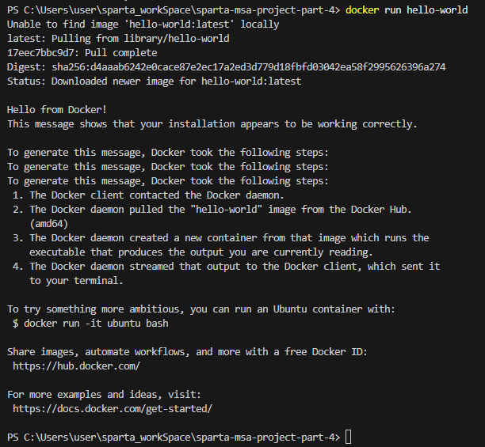

1. docker 설치 후 버전 확인하기
``` cmd
PS C:\Users\user\sparta_workSpace\sparta-msa-project-part-4> docker --version
Docker version 28.5.1, build e180ab8
```

2. docker run hello-world 실행 후 결과 캡처


3. 실행 중인 컨테이너 확인
``` cmd
PS C:\Users\user\sparta_workSpace\sparta-msa-project-part-4> docker ps -a
CONTAINER ID   IMAGE         COMMAND                   CREATED         STATUS                          PORTS                                         NAMES
d99dd63ee46b   hello-world   "/hello"                  4 minutes ago   Exited (0) About a minute ago         
                                        great_brown
4f98be56e69a   redis         "docker-entrypoint.s…"   4 weeks ago     Up 4 minutes                    0.0.0.0:6379->6379/tcp, [::]:6379->6379/tcp   redis-server
PS C:\Users\user\sparta_workSpace\sparta-msa-project-part-4> 
```

4. 컨테이너 정리

```cmd
PS C:\Users\user\sparta_workSpace\sparta-msa-project-part-4> docker stop great_brown
great_brown
PS C:\Users\user\sparta_workSpace\sparta-msa-project-part-4> docker rm great_brown
PS C:\Users\user\sparta_workSpace\sparta-msa-project-part-4> docker images
REPOSITORY         TAG       IMAGE ID       CREATED        SIZE
examplepart4-app   latest    d5d6bb64273c   6 days ago     352MB
redis              latest    1c390e3bb5cb   6 weeks ago    139MB
hello-world        latest    1b44b5a3e06a   4 months ago   10.1kB
PS C:\Users\user\sparta_workSpace\sparta-msa-project-part-4> docker rmi hello-world
Untagged: hello-world:latest
Untagged: hello-world@sha256:d4aaab6242e0cace87e2ec17a2ed3d779d18fbfd03042ea58f2995626396a274
Deleted: sha256:1b44b5a3e06a9aae883e7bf25e45c100be0bb81a0e01b32de604f3ac44711634
Deleted: sha256:53d204b3dc5ddbc129df4ce71996b8168711e211274c785de5e0d4eb68ec3851
```