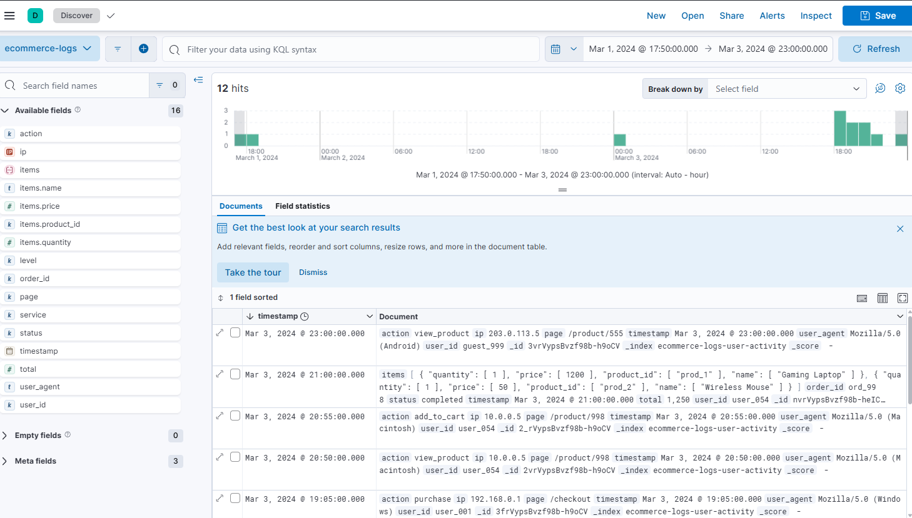
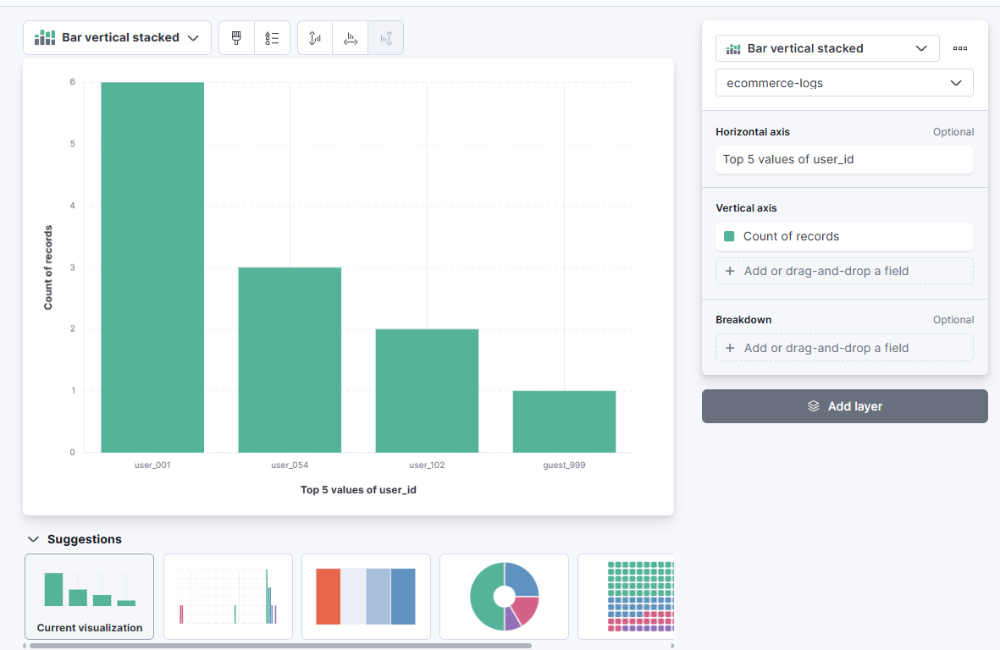
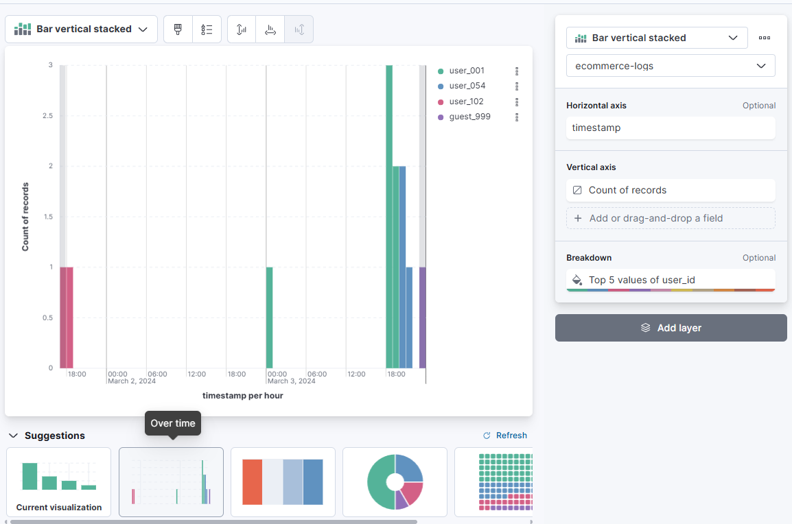
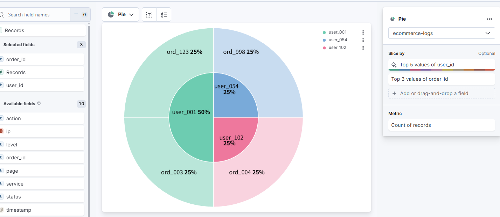
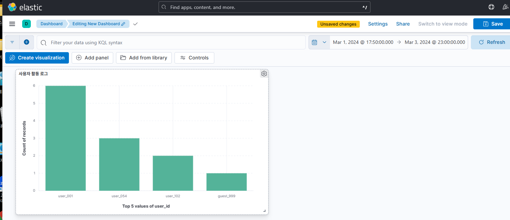
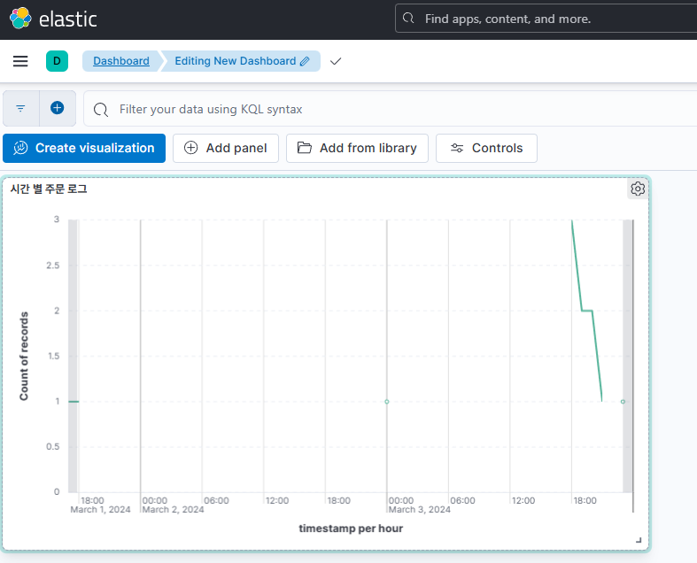

## Kibana 대시보드 구축

### 1. Discover 탭에서 예) ecommerce-logs-* 인덱스를 선택하여 데이터를 조회합니다.

### 2. Visualize 메뉴에서 바 차트, 선 그래프, 테이블 등 다양한 시각화 생성합니다.

### 3. 대시보드를 만들어서 주문 로그, 사용자 활동 로그 시각화합니다.

1. 사용자 활동 로그 시각화

2. 시간별 주문 로그
